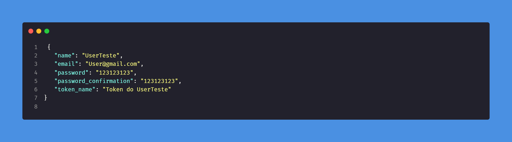
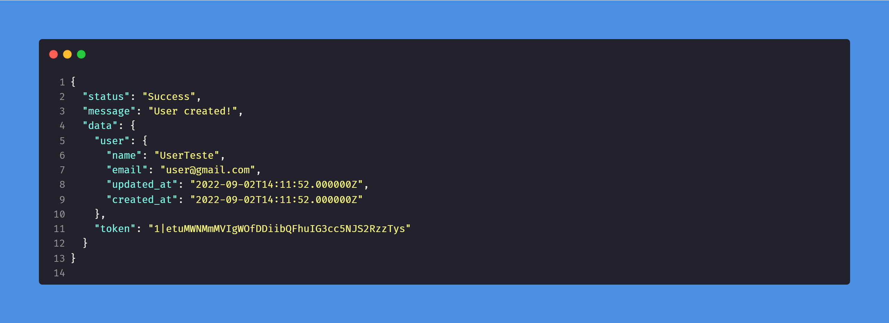
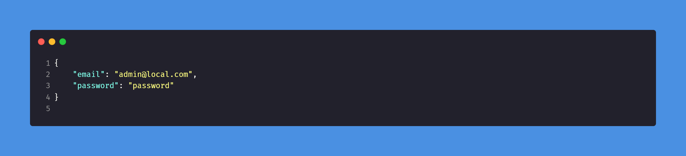
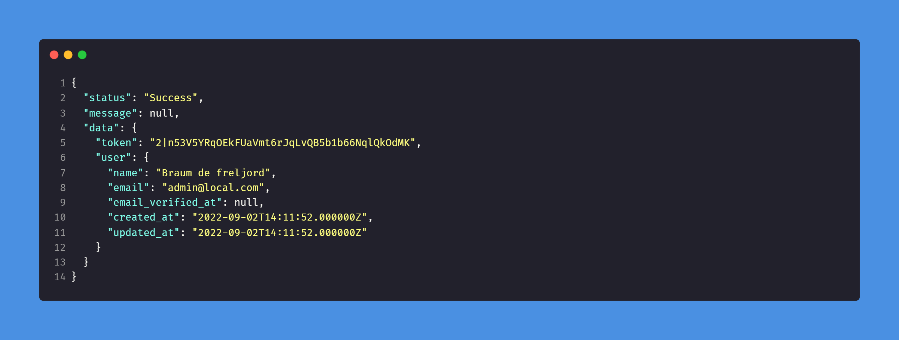
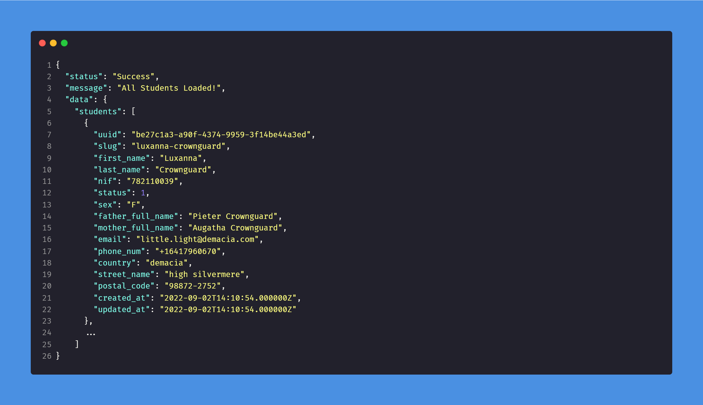
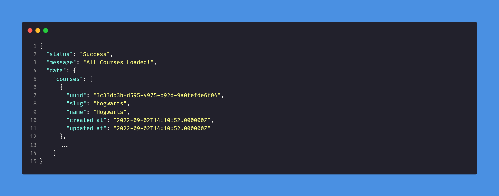
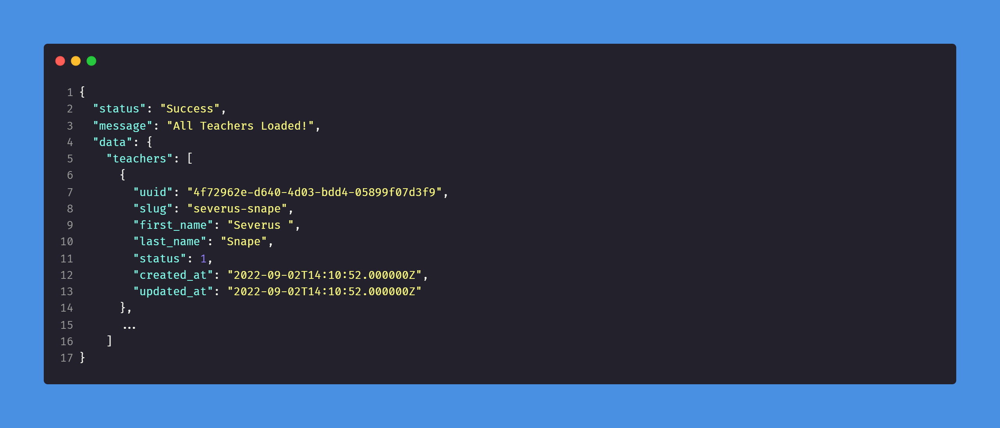
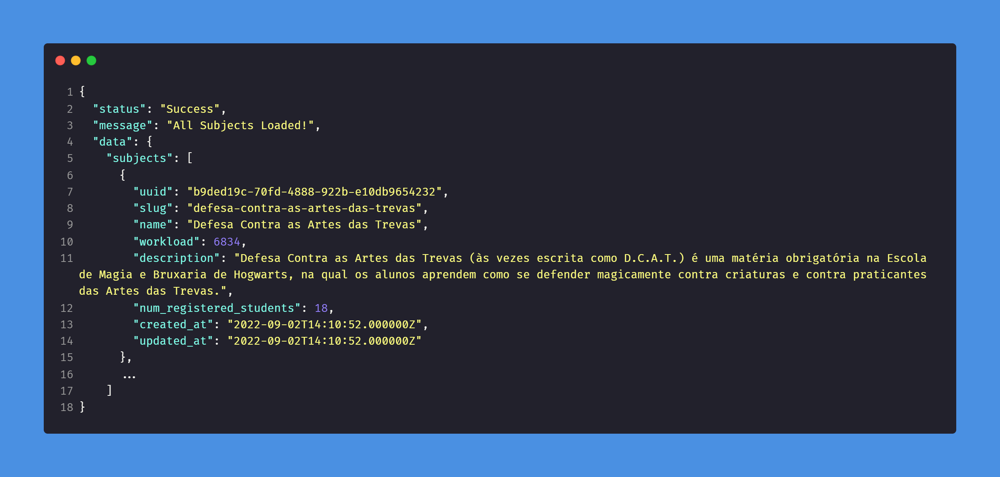
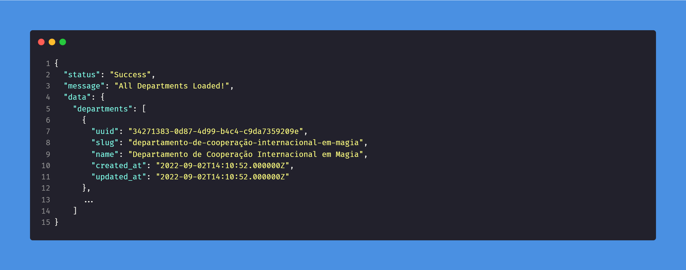

# Api Gestão universidade - Projeto Final Backend Flag

Uma Api conceito para Gestão de universidades. Feito como projeto final no curso de desenvolvimento back-end no grupo flag cursos.

Esse é um projeto desenvolvido em Laravel 9, que visa resolver um problema de gestão de uma universidade fictícia.

<br>

<hr>

<br/>

## Índice
### [Tecnologias](#destaque-das-tecnologias-utilizadas)

### [Conceitos / Patterns](#destaque-dos-conceitos-e-patterns-utilizados)

### [Pré-requisitos](#pré-requisitos)

### [Rodando localmente](#rodando-localmente)

### [Postman](#postman)
- [Documentação interna Postman](/wiki/postman.md)

### [Documentação da API](#documentação-da-api)

- [Api Auth](#api-auth)

  - [Documentação Auth](/wiki/api_auth.md)

- [Estudantes](#estudantes)

  - [Documentação Estudantes](/wiki/api_students.md)

- [Cursos](#cursos)

  - [Documentação Cursos](/wiki/api_courses.md)

- [Professores](#professores)

  - [Documentação Professores](/wiki/api_teachers.md)

- [Matérias](#matérias)

  - [Documentação Matérias](/wiki/api_subjects.md)

- [Departamentos](#departamentos)

  - [Documentação Departamentos](/wiki/api_departments.md)

<hr>
<br/>
<br/>


## Destaque das tecnologias utilizadas

| Tecnologias   | versão       | Descrição                           |
| :---------- | :--------- | :---------------------------------- |
| `PHP` | `8.1` | Uma linguagem de script de uso geral popular|
| `Laravel` | `9.x` | O Framework PHP para Artesãos da Web|
| `MySQL` | `15.x` | O MySQL é um sistema de gerenciamento de banco de dados, que utiliza a linguagem SQL como interface.|
| `Laravel Debuger` | `3.7` | Monitoramento de erros e desempenho do Laravel|
| `Guzzlehttp` | `7.4` | Guzzle é um cliente PHP HTTP que facilita o envio de solicitações HTTP.|
| `Sanctum` | `3.0` | Laravel Sanctum Fornece um sistema de autenticação leve para SPAs (aplicativos de página única), aplicativos móveis e APIs simples baseadas em token. |
| `Vite` | `3.0` | Vite é uma ferramenta de construção que foi inicialmente desenvolvida para Vue.js.|
| `Postman` | `9.x` | Postman é uma plataforma de API para desenvolvedores projetar, construir, testar e iterar suas APIs.|
| `Dbeaver` | `22.x` | DBeaver é um aplicativo de software cliente SQL e uma ferramenta de administração de banco de dados.|
| `Migration` | `---` | As migrações são como controle de versão para seu banco de dados, permitindo que sua equipe defina e compartilhe a definição do esquema de banco de dados do aplicativo.|
| `PSR-4`|  `---` | A PSR-4 é uma recomendação da comunidade PHP para organização e carregamento de arquivos e classes PHP.|

<br>
<br>

## Destaque dos conceitos e patterns utilizados

| Conceitos/Patterns    | Descrição                           |
| :---------- | :---------------------------------- |
| `MVC` | MVC é o acrônimo de Model-View-Controller é um padrão de projeto de software, ou padrão de arquitetura de software.|
| `POO` | Programação orientada a objetos é um paradigma de programação baseado no conceito de "objetos".|
| `PHP SOLID` | SOLID é um acrônimo para os primeiros cinco princípios de design orientado a objetos (OOD).|
| `API RESTful `| Api Rest é uma interface de programação de aplicações (API ou API web) que está em conformidade com as restrições do estilo de arquitetura REST, permitindo a interação com serviços web RESTful. |
| `Gitflow`| Gitflow é um fluxo de trabalho Git legado que originalmente era uma estratégia inovadora e disruptiva para gerenciar ramificações do Git.|
| `Builder pattern`| Builder é um padrão de projeto de software criacional que permite a separação da construção de um objeto complexo da sua representação. |
| `Factory pattern`| Use uma função de fábrica para criar objetos.|
| `Provider pattern` | Disponibilize dados para vários componentes filhos.|
| `Banco de dados relacional` | Um banco de dados relacional é um banco de dados que modela os dados de uma forma que eles sejam percebidos pelo usuário como tabelas, ou mais formalmente relações.|

<br>

## Pré-requisitos

- PHP ^8.1
- MySql ^15
- Laravel 9.x
- Servidor Linux

<br>

[Início](#api-gestão-universidade---projeto-final-backend-flag)

<hr>

<br>
<br>

## Rodando localmente

### Clone o projeto

```bash
  git clone https://github.com/DaniloWA/backEndFlag-app.git
```

### Entre no diretório do projeto

```bash
  cd backEndFlag-app/
```
### Copiar ficheiro environment

```bash
  cp .env.example .env
```

### Instale as dependências

```bash
  composer install
```
### Gerar key de criptografia

> Essa chave é usada pelo serviço de criptografia Illuminate e deve ser definida como uma cadeia aleatória de 32 caracteres, caso contrário, essas cadeias criptografadas não serão seguras. Faça isso antes de implantar um aplicativo!

```bash
  php artisan key:generate
```

### Definir configuração da conexão da base de dados
#### Subistitui essas linhas no ficheiro ./.env

```bash
  DB_CONNECTION=mysql
  DB_HOST=127.0.0.1
  DB_PORT=3306
  DB_DATABASE=university
  DB_USERNAME=root
  DB_PASSWORD=
```
> Caso o nome da base de dados seja diferente altere essa linha : DB_DATABASE= \< NOME_AQUI \>

### Criando base de dados

```bash
  php artisan migrate
```

### (Opcional) Povoando base de dados com dados 

```bash
  php artisan db:seed
```
### (Opcional) Ou pode rodar os ultimos dois passos em conjuto

```bash
  php artisan migrate --seed
```

<br>

[Início](#api-gestão-universidade---projeto-final-backend-flag)

<hr>
<br>
<br>

# Postman

### Importar suite de endpoints para o [Postman](/postman) (ficheiros)


### Passo a Passo para importação do ficheiro do endpoint pelo GUI


<br>

### Passo a Passo para importação do ficheiro do environment pelo GUI


```bash
  cd ./postman
```

#### (Opcional) Para visualizar os dados dos endpoints

```bash
  cat .\api_backendflag.postman_collection.json 
```

#### (Opcional) Para visualizar os dados do ambiente local do environment

```bash
  cat .\api_backendflag.postman_environment.json

```
### Importar suite de endpoints para o Postman

```bash
  cd ./postman
```
<br>

# Documentação das variaveis de environment 
[Documentação](/wiki/postman.md) do Postman explicando variavies e scripts.

<br>

[Início](#api-gestão-universidade---projeto-final-backend-flag)

<hr>
<br>
<br>

# Documentação da API

# [Api Auth](/wiki/api_auth.md)

<br>

## POST /register

```
  http://[SUA_URL]/api/auth/register
```
<br>

#### BODY



<details> 
  <summary>Code</summary>

```json
{
    "name": "UserTeste",
    "email": "User@gmail.com",
    "password": "123123123",
    "password_confirmation": "123123123",
    "token_name": "Token do UserTeste"
}
```

</details>

<br>

#### Response 200



<details> 
  <summary>Code</summary>

```json
{
    "status": "Success",
    "message": "User created!",
    "data": {
        "user": {
        "name": "UserTeste",
        "email": "user@gmail.com",
        "updated_at": "2022-09-02T14:11:52.000000Z",
        "created_at": "2022-09-02T14:11:52.000000Z"
        },
        "token": "1|etuMWNMmMVIgWOfDDiibQFhuIG3cc5NJS2RzzTys"
    }
}
```

</details>

<br>

## POST /login

```
  http://[SUA_URL]/api/auth/login
```

<br>

#### BODY



<details> 
  <summary>Code</summary>

```json
{
    "email": "admin@local.com",
    "password": "password"
}
```

</details>

<br>

#### Response 200



<details> 
  <summary>Code</summary>

```json
{
  "status": "Success",
  "message": null,
  "data": {
    "token": "2|n53V5YRqOEkFUaVmt6rJqLvQB5b1b66NqlQkOdMK",
    "user": {
      "name": "Braum de freljord",
      "email": "admin@local.com",
      "email_verified_at": null,
      "created_at": "2022-09-02T14:11:52.000000Z",
      "updated_at": "2022-09-02T14:11:52.000000Z"
    }
  }
}
```

</details>

<br>

[Início](#api-gestão-universidade---projeto-final-backend-flag)

<br>

# [Estudantes](/wiki/api_students.md)

<br>

## GET /students

```
  http://[SUA_URL]/api/students
```
#### Header

```json
  { 
    "Authorization": "Bearer {{ token }}"
 }
```

<br>

#### Response 200



<details> 
  <summary>Code</summary>

```json
{
  "status": "Success",
  "message": "All Students Loaded!",
  "data": {
    "students": [
      {
        "uuid": "be27c1a3-a90f-4374-9959-3f14be44a3ed",
        "slug": "luxanna-crownguard",
        "first_name": "Luxanna",
        "last_name": "Crownguard",
        "nif": "782110039",
        "status": 1,
        "sex": "F",
        "father_full_name": "Pieter Crownguard",
        "mother_full_name": "Augatha Crownguard",
        "email": "little.light@demacia.com",
        "phone_num": "+16417960670",
        "country": "demacia",
        "street_name": "high silvermere",
        "postal_code": "98872-2752",
        "created_at": "2022-09-02T14:10:54.000000Z",
        "updated_at": "2022-09-02T14:10:54.000000Z"
      },
      ...
    ]
}
```

</details>

<br>

[Início](#api-gestão-universidade---projeto-final-backend-flag)

<br>

# [Cursos](/wiki/api_courses.md)

<br>

## GET /courses

```
  http://[SUA_URL]/api/courses
```
#### Header

```json
  { 
    "Authorization": "Bearer {{ token }}"
 }
```

<br>

#### Response 200



<details> 
  <summary>Code</summary>

```json
{
  "status": "Success",
  "message": "All Courses Loaded!",
  "data": {
    "courses": [
      {
        "uuid": "3c33db3b-d595-4975-b92d-9a0fefde6f04",
        "slug": "hogwarts",
        "name": "Hogwarts",
        "created_at": "2022-09-02T14:10:52.000000Z",
        "updated_at": "2022-09-02T14:10:52.000000Z"
      },
      ...
    ]
}
```

</details>

<br>

[Início](#api-gestão-universidade---projeto-final-backend-flag)

<br>

# [Professores](/wiki/api_teachers.md)

<br>

## GET /teachers

```
  http://[SUA_URL]/api/teachers
```
#### Header

```json
  { 
    "Authorization": "Bearer {{ token }}"
 }
```

<br>

#### Response 200



<details> 
  <summary>Code</summary>

```json
{
  "status": "Success",
  "message": "All Teachers Loaded!",
  "data": {
    "teachers": [
      {
        "uuid": "4f72962e-d640-4d03-bdd4-05899f07d3f9",
        "slug": "severus-snape",
        "first_name": "Severus ",
        "last_name": "Snape",
        "status": 1,
        "created_at": "2022-09-02T14:10:52.000000Z",
        "updated_at": "2022-09-02T14:10:52.000000Z"
      },
      ...
    ]
}
```

</details>

<br>

[Início](#api-gestão-universidade---projeto-final-backend-flag)

<br>

# [Matérias](/wiki/api_subjects.md)

<br>

## GET /subjects

```
  http://[SUA_URL]/api/subjects
```
#### Header

```json
  { 
    "Authorization": "Bearer {{ token }}"
 }
```

<br>

#### Response 200



<details> 
  <summary>Code</summary>

```json
{
  "status": "Success",
  "message": "All Subjects Loaded!",
  "data": {
    "subjects": [
      {
        "uuid": "b9ded19c-70fd-4888-922b-e10db9654232",
        "slug": "defesa-contra-as-artes-das-trevas",
        "name": "Defesa Contra as Artes das Trevas",
        "workload": 6834,
        "description": "Defesa Contra as Artes das Trevas (às vezes escrita como D.C.A.T.) é uma matéria obrigatória na Escola de Magia e Bruxaria de Hogwarts, na qual os alunos aprendem como se defender magicamente contra criaturas e contra praticantes das Artes das Trevas.",
        "num_registered_students": 18,
        "created_at": "2022-09-02T14:10:52.000000Z",
        "updated_at": "2022-09-02T14:10:52.000000Z"
      },
      ...
    ]
}
```

</details>


<br>

[Início](#api-gestão-universidade---projeto-final-backend-flag)

<br>

# [Departamentos](/wiki/api_departments.md)

<br>

## GET /departments

```
  http://[SUA_URL]/api/departments
```
#### Header

```json
  { 
    "Authorization": "Bearer {{ token }}"
 }
```

<br>

#### Response 200



<details> 
  <summary>Code</summary>

```json
{
  "status": "Success",
  "message": "All Departments Loaded!",
  "data": {
    "departments": [
      {
        "uuid": "34271383-0d87-4d99-b4c4-c9da7359209e",
        "slug": "departamento-de-cooperação-internacional-em-magia",
        "name": "Departamento de Cooperação Internacional em Magia",
        "created_at": "2022-09-02T14:10:52.000000Z",
        "updated_at": "2022-09-02T14:10:52.000000Z"
      },
      ...
    ]
}
```

</details>

<br>

[Início](#api-gestão-universidade---projeto-final-backend-flag)


